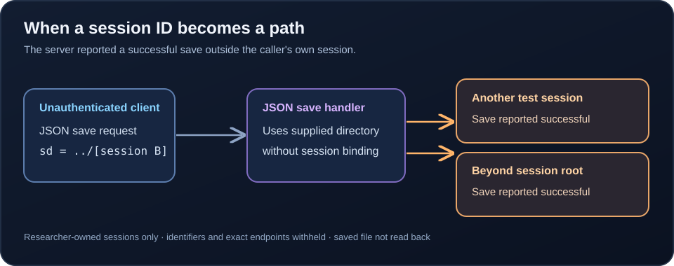
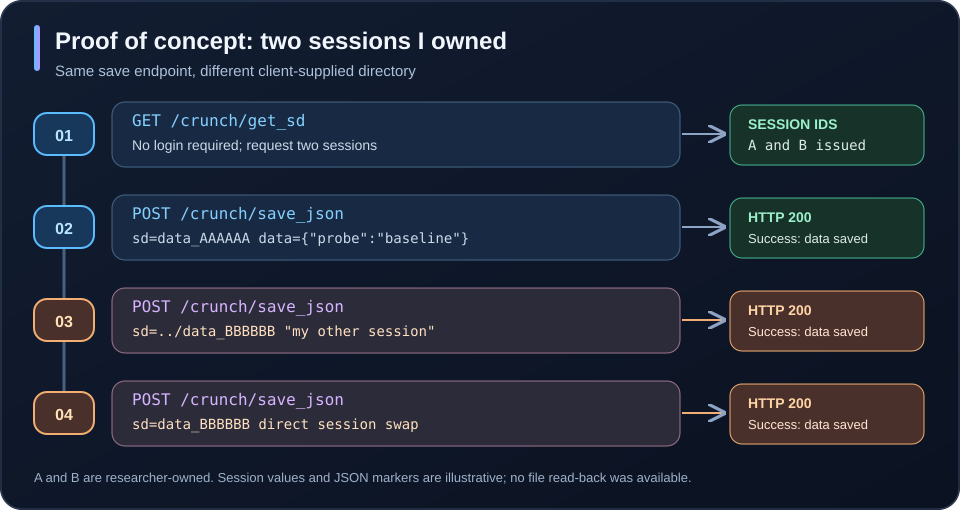
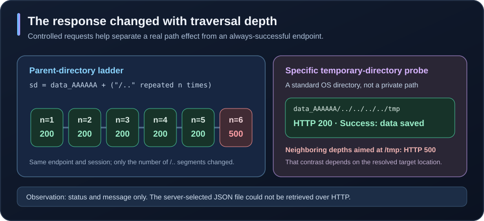
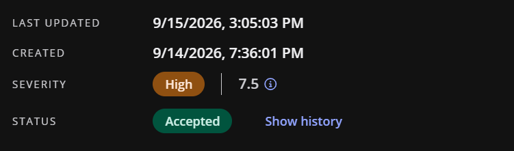

## The short version

CRUNCH is a research application that saves a job's settings as JSON. Its browser first obtains a session ID, then sends that ID back when saving. The problem was that the save endpoint treated the browser-supplied `sd` value as a directory selector. A visitor who had not signed in could substitute a different session ID or add `../` to move the save operation through the server's directory tree.

On September 14, 2026, I tested this using **two sessions I created myself**. A save aimed at my second session returned the same HTTP 200 / `Success: data saved` response as a normal save. A separate probe with traversal components reported success at a depth that reached an existing writable directory outside the intended session tree; adjacent-depth controls failed. The evidence is a server-reported write and path-dependent responses, not a read-back of the saved file.



## How the feature should work

`GET /crunch/get_sd` issued a session identifier without requiring authentication. The observed format was `data_` followed by six letters or digits. The browser then submitted job settings to `POST /crunch/save_json` with two relevant parameters:

| Parameter | Purpose |
| --- | --- |
| `sd` | Selects the session directory where the server saves the JSON. |
| `data` | Contains the JSON job settings to save. |

For a normal save, the server should write only to the session it issued to that requester. Instead, it trusted `sd` as a path component and did not verify that the requester owned the selected session. That made this both a **session-authorization** issue and a **path-traversal** issue (CWE-22). A direct session swap worked without `../`; traversal also allowed the directory boundary to be crossed.

## Proof of concept: two researcher-owned sessions

The sequence below preserves the routes, parameters, and observed responses. `data_AAAAAA` and `data_BBBBBB` are **illustrative replacements** for the two real IDs; the JSON markers are harmless examples, not secrets or production data.

```text
1. GET /crunch/get_sd
   -> data_AAAAAA   (my session A)

   GET /crunch/get_sd
   -> data_BBBBBB   (my session B)

2. POST /crunch/save_json
   sd=data_AAAAAA
   data={"probe":"baseline"}
   -> HTTP 200, "Success: data saved"

3. POST /crunch/save_json
   sd=../data_BBBBBB
   data={"probe":"cross-session test"}
   -> HTTP 200, "Success: data saved"

4. POST /crunch/save_json
   sd=data_BBBBBB
   data={"probe":"direct session test"}
   -> HTTP 200, "Success: data saved"
```

Step 3 shows that the handler accepted a parent-directory component. Step 4 matters separately: the sibling session ID also worked **without traversal**, so blocking `../` alone would not fix the missing session ownership check. I used my own session B as the target; I did not modify anyone else's work.



## Controls: why this points to a filesystem path

A success message on its own could be misleading. I compared valid and invalid directory selections using the same endpoint:

| `sd` value | Observed result | What it showed |
| --- | --- | --- |
| `data_AAAAAA` | HTTP 200, `Success: data saved` | My existing session was accepted. |
| `data_BBBBBB` | HTTP 200, `Success: data saved` | Another session I owned was accepted directly. |
| `../data_BBBBBB` | HTTP 200, `Success: data saved` | A parent-directory component was accepted. |
| Nonexistent `data_` session ID (value masked) | HTTP 500 | A nonexistent session directory failed. |
| `data_AAAAAA/sub1` | HTTP 500 | A missing subdirectory failed; the endpoint did not create it. |
| `..` | HTTP 200, `Success: data saved` | A bare traversal component was accepted. |

For an additional boundary test, I appended `/..` repeatedly to my session path. Depths **1 through 5** returned HTTP 200; depth **6** returned HTTP 500. The probe `sd=data_AAAAAA/../../../../tmp` returned HTTP 200, while the neighboring-depth versions aimed at `/tmp` returned HTTP 500. `/tmp` is the standard temporary-directory name; the real session ID remains masked here. That response pattern is consistent with resolving paths against the filesystem: it was not an endpoint that simply returned 200 for every input.



## Impact and limits

The demonstrated impact is **integrity**. An unauthenticated requester could make the save handler report a successful write for a different session directory, and the traversal probe showed that the handler was not confined to the intended per-session tree. If another user's session ID were available, their saved job settings could be at risk. The source report notes that session IDs can appear in bookmarkable report URLs. The application uses saved settings for research jobs; examples include foreground/background file URLs, organism choices, and a results email address. Changing a later job's inputs or recipient is a plausible consequence, **not an outcome I verified**.

The server selected the JSON filename, and I could not retrieve the saved file over HTTP to check its bytes. These tests do **not** demonstrate arbitrary filename control, file deletion, confidential-data access, remote code execution, or a meaningful availability impact. Successful requests also depended on the target directory already existing and being writable. I did not run a downstream job or test anyone else's session. The source report assessed the issue as **Medium** based on the demonstrated cross-session integrity risk and escape from the session directory boundary.

## Recommended fix

1. Stop using a client-supplied session token directly as a filesystem path. Map an opaque token to a server-held directory.
2. Bind each issued token to its requester or an equivalent server-side capability. Check ownership on every save, even when `sd` has no traversal characters.
3. As an immediate input constraint, accept only the issued token format (the observed format was `^data_[A-Za-z0-9]{6}$`). This is defense in depth, **not** a replacement for authorization.
4. Resolve the candidate with a canonical path operation such as `realpath()`, then require it to be strictly inside an authorized per-session directory. Reject the session root itself and any path that escapes it.
5. Return a controlled 4xx response for malformed or unauthorized input instead of exposing filesystem-driven 500 errors. Restrict the web process's write permissions so unrelated directories are not writable by the application.

The other route mentioned in the source report, `/crunch/run`, was only explored superficially and is not part of this finding.

## Report status

The University of Basel dashboard showed **Accepted** and **High (7.5)** when this screenshot was captured. It records the displayed submission status, not whether the issue remains reproducible.


