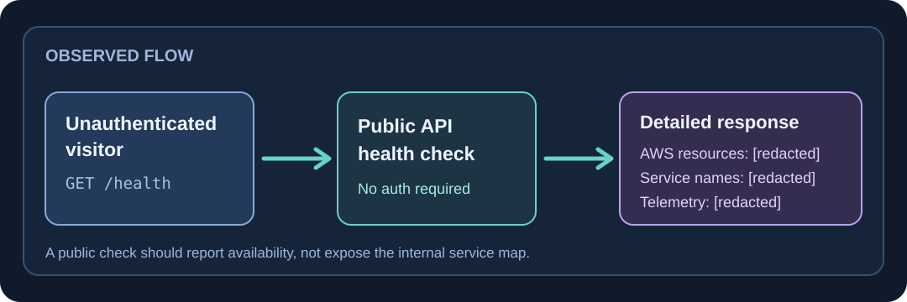
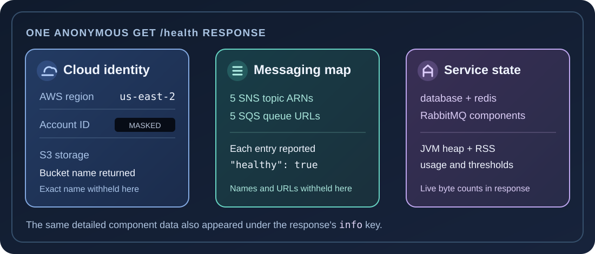
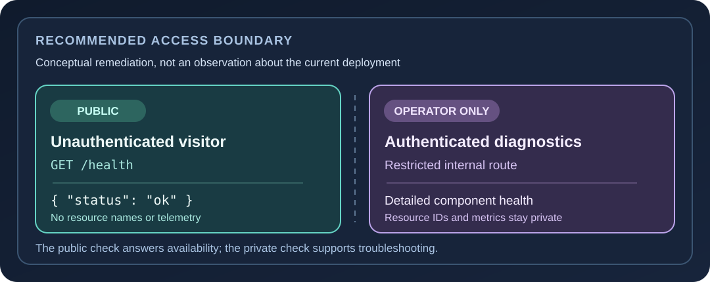
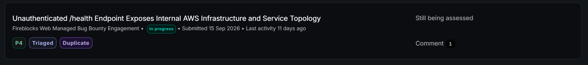

## The finding in plain English

A public health check should tell a visitor whether a service is available. The Fireblocks sandbox mobile API's `/health` response went further: one request, with no account or authentication material, returned a small map of the services behind the API. It named AWS resource types and application components, exposed the AWS region and account identifier, and included live memory measurements.

This is **information disclosure**, not a way to log in to AWS. The exposed data makes reconnaissance more precise, but my test did not show a leaked credential or access to any of the named resources.



*Illustration of the observed request and response, with identifiers masked.*

## Proof of concept: one unauthenticated request

On September 15, 2026, I sent a single `GET` request to `/health` on the in-scope sandbox mobile API. I did not supply a token, cookie, API key, or signed request. The endpoint returned detailed JSON rather than only an aggregate health result.

```http
GET /health HTTP/1.1
Host: [Fireblocks sandbox mobile API host]
Accept: application/json
```

The excerpt below keeps the actual JSON field names, component statuses, AWS region, and sampled memory numbers. Only the account ID and reusable resource or component names are replaced with placeholders. The original response contained more entries than this shortened example.

```json
{
  "details": {
    "s3": {"status": "up", "details": {"[bucket name]": {"healthy": true}}},
    "database": {"status": "up"},
    "redis": {"status": "up"},
    "sns": {"status": "up", "details": {
      "arn:aws:sns:us-east-2:[ACCOUNT_ID]:[topic name]": {"healthy": true}
    }},
    "sqs": {"status": "up", "details": {
      "https://sqs.us-east-2.amazonaws.com/[ACCOUNT_ID]/[queue name]": {"healthy": true}
    }},
    "rabbitMq": {"status": "up", "details": {
      "[component name]": {"healthy": true}
    }},
    "heapMemory": {"status": "up", "details": {
      "used": 143719040, "threshold": 1073741824
    }},
    "rssMemory": {"status": "up", "details": {
      "used": 317169664, "threshold": 3145728000
    }}
  },
  "info": {"[detailed component data repeated]": "..."}
}
```

Those memory numbers are a single historical sample in bytes, not current telemetry. The `info` object repeated the detailed component information; the line above abbreviates it rather than inventing its structure.



## What the response revealed

| Area | Observed detail | Why it helps an outsider |
| --- | --- | --- |
| AWS identity | Account ID and `us-east-2` region | Ties otherwise separate resource names to one cloud environment. The account number is masked here. |
| Messaging | **Five SNS topic ARNs** and **five SQS queue URLs** | Shows that the mobile API depends on multiple messaging paths and reveals their naming relationships. |
| Storage | An S3 bucket name | Identifies a storage dependency and its naming convention. |
| Application services | `database`, `redis`, and RabbitMQ health entries, including RabbitMQ component names | Reveals which backend pieces are present and whether they reported healthy at that moment. |
| Runtime | `heapMemory` and `rssMemory` usage and thresholds | Exposes a snapshot of JVM memory state and configured limits. |

The exact resource names, queue URLs, topic ARNs, account number, and component names are omitted because they identify live infrastructure. The field names, counts, statuses, region, and numerical telemetry remain so the behavior is understandable and verifiable without those identifiers.

## Impact and limits

An unauthenticated visitor could learn the service's cloud region, discover how storage and messaging components fit together, and use the names and status fields to guide later investigation. Inference from this disclosure: someone who repeatedly queried an unchanged endpoint could potentially watch for status changes. I performed **one request** and did not test sustained polling.

The response did **not** contain an AWS access key, secret, or session token in the evidence I reviewed. I did not connect to the exposed bucket, queues, or topics, and I did not demonstrate unauthorized access to Fireblocks data. I therefore assessed the observed issue as **P4 / low-severity sensitive data exposure**, matching the scope of the original report rather than claiming a larger compromise.

## Recommended fix

1. Make detailed health diagnostics reachable only from an internal interface or by authenticated operators, using the same access expectations as nearby application routes.
2. If an unauthenticated health endpoint is needed, return one aggregate result, such as `{"status":"ok"}`, without `details`, `info`, resource identifiers, component names, or runtime measurements.
3. Check other health, debug, and status routes for the same response pattern. An automated check can assert that anonymous responses never contain account IDs, ARNs, queue URLs, bucket names, or live metrics.



The observation was made on September 15, 2026. This post does not claim the endpoint is still exposed today.

## Report status

The program dashboard showed **In progress**, **Triaged**, **Duplicate**, and **P4** when this screenshot was captured. These labels record the displayed submission status, not whether the endpoint remains exposed.


