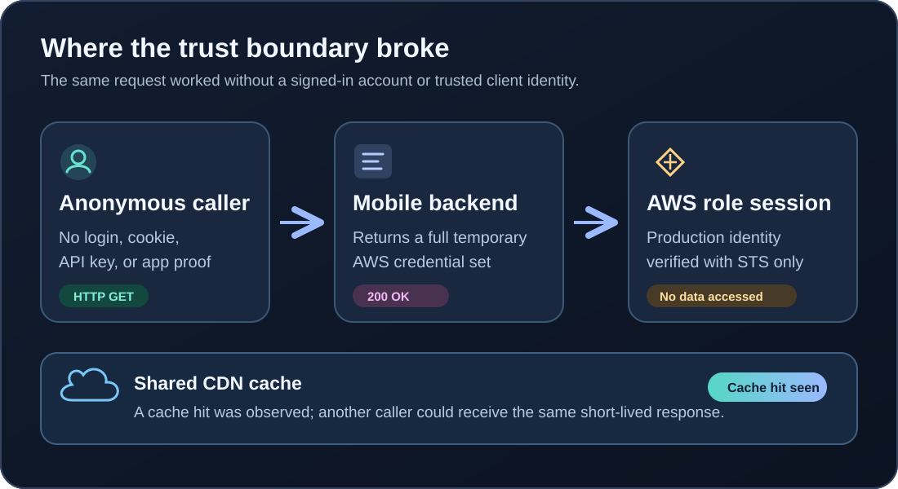
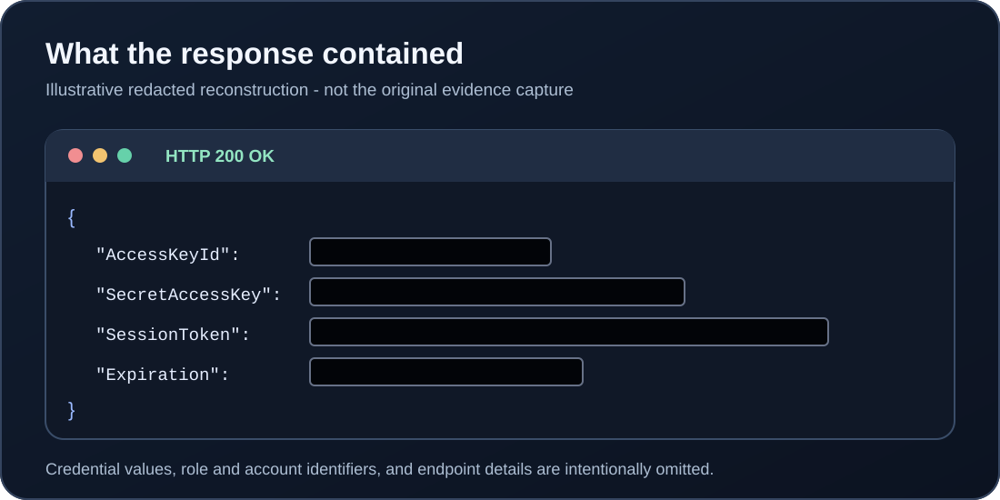
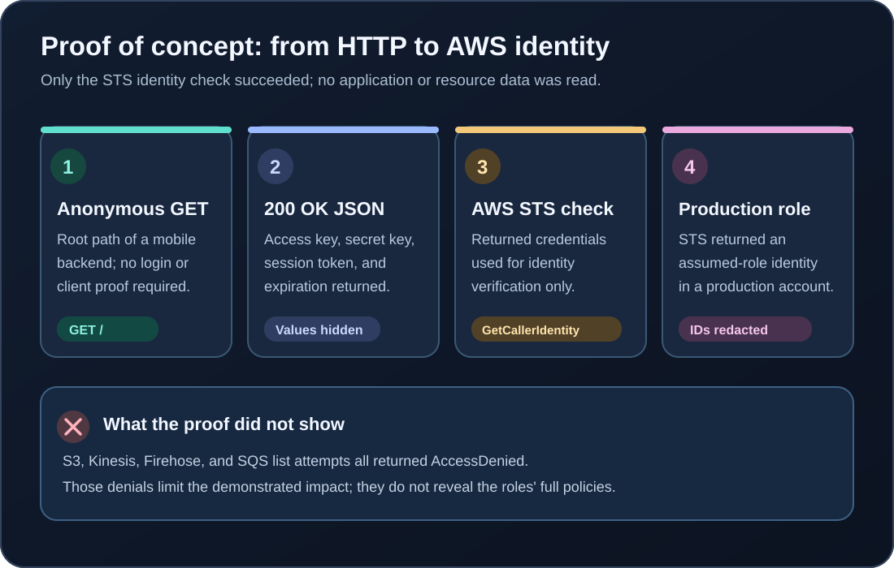
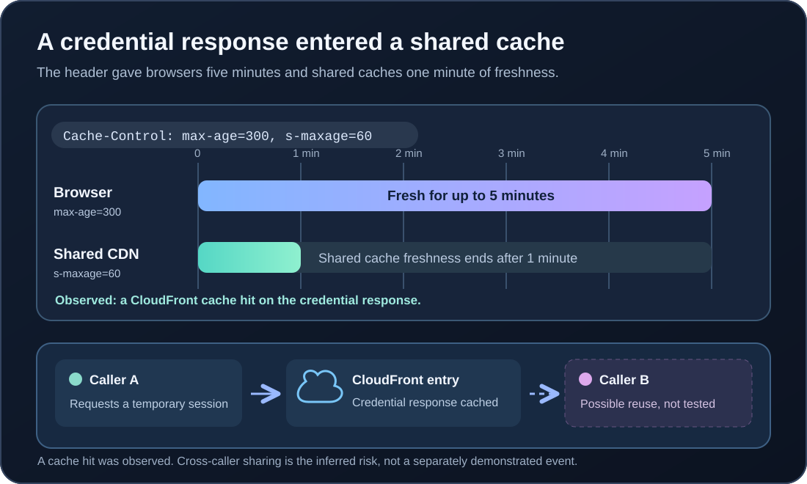
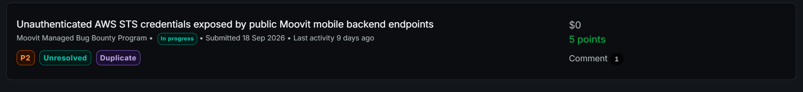

## What I found

I found four Moovit mobile-backend host variants that would hand an anonymous caller a complete set of temporary AWS credentials. Two were production hosts; the other two had development hostnames. A caller did not need a Moovit account, session cookie, API key, signed request, or proof that the official app made the request.

This matters because an AWS STS credential is a short-lived key to an IAM role. It expires, but until then it carries whatever permissions that role has. I verified that credentials from the **two production endpoints** authenticated as sessions in **two separate production AWS accounts**. I did not find or claim access to application data.



## The request and response

The proof of concept was unusually simple: send an ordinary `GET` request to the root of either affected production host. The same credential-issuing behavior was also observed on their two development-hostname variants. I have replaced the host with a label; the request method and root path are unchanged.

The four variants formed two pairs: production service A and its development variant issued into production AWS account A; production service B and its development variant issued into production AWS account B. The development variants used differently named roles, but they were **not** isolated to development-only AWS accounts.

```http
GET / HTTP/1.1
Host: [redacted Moovit mobile-backend host]
```

The service returned `200 OK` with JSON containing all four parts of a usable STS session. The structure below follows the report; the values are placeholders, not live credentials.

```json
{
  "AccessKeyId": "ASIA[REDACTED]",
  "SecretAccessKey": "[REDACTED]",
  "SessionToken": "[REDACTED]",
  "Expiration": "[REDACTED timestamp]"
}
```

`AccessKeyId` identifies the temporary key; `SecretAccessKey` and `SessionToken` are the secrets used with it. `Expiration` says when the session stops working. Having **all three credential values** is different from merely seeing an account number or role name in a response.



## Proof of concept and validation

I used the returned values only to ask AWS STS who the session represented. The validation sequence was: request the JSON, set the three AWS credential environment variables from it, then call `aws sts get-caller-identity`. The host below is deliberately nonfunctional; it shows the procedure without exposing the endpoint.

```bash
creds="$(curl -sS 'https://[redacted-mobile-backend-host]/')"
export AWS_ACCESS_KEY_ID="$(printf '%s' "$creds" | jq -r '.AccessKeyId')"
export AWS_SECRET_ACCESS_KEY="$(printf '%s' "$creds" | jq -r '.SecretAccessKey')"
export AWS_SESSION_TOKEN="$(printf '%s' "$creds" | jq -r '.SessionToken')"
aws sts get-caller-identity
```

The identity call succeeded for both production responses and returned assumed-role identities in two production AWS accounts. This proves the response contained valid AWS sessions, rather than merely JSON that looked like credentials. The development variants also issued credentials tied to those production accounts, but the report's explicit STS identity results cover the **two production responses**.

The identifying values are hidden here, but the successful STS output had this shape:

```json
{
  "UserId": "[REDACTED]",
  "Account": "[REDACTED production account]",
  "Arn": "arn:aws:sts::[ACCOUNT]:assumed-role/[ROLE]/[SESSION]"
}
```



I also tried four broad, low-impact enumeration calls: S3 `list_buckets`, Kinesis `list_streams`, Firehose `list_delivery_streams`, and SQS `list_queues`. Each returned `AccessDenied`. That is a useful limit on the evidence, but it does **not** prove the roles had no other permissions; their full policies were not established by these checks.

## The cache made the exposure more concerning

One production response passed through CloudFront with `Cache-Control: max-age=300, s-maxage=60`. In practical terms, that header permitted a browser to treat the response as fresh for **five minutes** and a shared cache to treat it as fresh for **one minute**. I observed a CloudFront cache hit on the credential response.

A credential-vending response should not be reusable by another client. The cache hit and header show a path by which an unrelated caller **could** receive the same temporary session during the shared-cache window. I did not test two unrelated users to prove that exact cross-user reuse occurred, so I treat it as an added risk rather than a separately demonstrated compromise.



## Impact and evidence boundary

The confirmed vulnerability is **unauthenticated issuance of valid temporary production-role credentials**. Anyone who could reach the affected service could obtain a session carrying that role's permissions until expiration. The development variants issuing sessions into production accounts also raise an environment-separation concern. The observed cache hit added a potential credential-sharing route.

The report does **not** demonstrate reading application data, listing AWS resources, changing cloud infrastructure, or taking over an account. Those outcomes depend on the actual IAM permissions and were not established by my tests. The original report was validated on September 16 and rechecked on September 18, 2026; its evidence included two complete response captures, which I have not republished because they contain live credential values.

## How to fix it

1. **Stop anonymous issuance.** Require server-side authentication and authorization before giving a client AWS credentials. If only the official mobile app should use the service, app or device attestation can add a signal, but it should not be the only control.
2. **Keep credential responses out of caches.** Send `Cache-Control: no-store`, configure CloudFront not to cache credential-vending routes, and invalidate any cached responses.
3. **Constrain the issued roles.** Review each role's trust and permission policies, reduce privileges to what the consumer needs, and bind issuance to a specific authenticated consumer or backend exchange.
4. **Detect abuse.** Rate-limit issuance and monitor unusual request volume and downstream session use.
5. **Separate environments.** Review why development-hostname variants can issue sessions into production accounts; remove that path unless it is necessary and access-controlled.

_Endpoint hosts, AWS account numbers, role identifiers, and credential values are redacted. Request method, response fields, cache settings, validation calls, results, and dates are retained from the report._

## Report status

The program dashboard showed **In progress**, **Unresolved**, **Duplicate**, and **P2** when this screenshot was captured. These labels record the displayed submission status, not whether the endpoint remains exposed.


