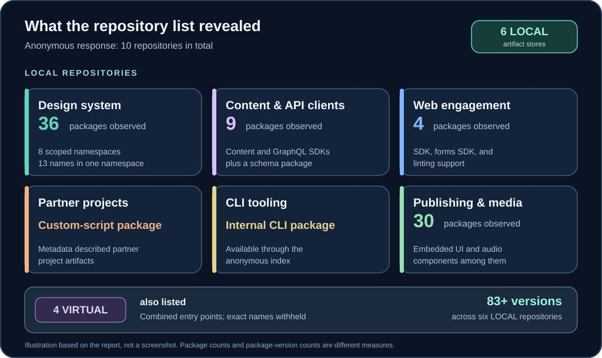
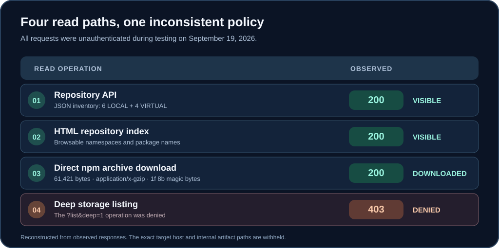

## The finding in plain language

Artifactory is a package warehouse: development teams put reusable code and build artifacts there so other projects can install them. On September 19, 2026, I found a publicly reachable Red Bull Artifactory instance where **an anonymous visitor could browse internal npm repositories and download package archives**. No account, token, or session was needed for the read paths I tested.

The issue was more than a visible package name. I downloaded an npm archive containing Node.js API-client implementation files. Those files described how a content-management client was organized, including its API-key authentication provider and content-management services. I did **not** find credentials in the five packages I reviewed.


*Reconstruction of the observed paths; this is not a screenshot of the target service.*

## How much was visible?

The repository API returned **10 configured repositories: six LOCAL and four VIRTUAL**. A local repository stores artifacts; a virtual repository presents one or more repositories through a combined entry point. Across the six local repositories, I identified **at least 83 package versions**.



The local repositories covered several kinds of work:

| Area, with its repository name withheld | What I observed |
| --- | --- |
| Design system | 36 packages and eight scoped namespaces. One namespace alone exposed 13 package names, including foundations, web, configuration, and framework-specific packages. |
| Content and API clients | Nine packages, including Node SDKs for content and GraphQL APIs and a content schema package. |
| Web engagement | Four packages covering an engagement SDK, forms SDK, and linting support. |
| Partner projects | A custom-script package whose metadata described partner-project artifacts. |
| Command-line tooling | An internal CLI package. |
| Publishing and media components | 30 packages, including embedded UI and audio-related components. |

These are package observations from individual repositories. The **83-plus** figure counts package *versions* across all six local repositories, so it should not be calculated by adding the table's package counts. Exact repository, scope, package, and version identifiers are omitted from this public post.

## Proof of concept and observed responses

I made the requests without authentication. The following request shapes preserve the important behavior while replacing the target host and internal artifact paths with placeholders; they are **illustrative**, not a copy-paste transcript.

```text
GET https://[artifactory-host]/artifactory/api/repositories
-> HTTP 200; JSON describing 10 repositories (6 LOCAL, 4 VIRTUAL)

GET https://[artifactory-host]/artifactory/[design-system-local]/
-> HTTP 200; browsable HTML index with 8 scoped namespaces

GET https://[artifactory-host]/artifactory/[content-api-local]/[package-archive].tgz
-> HTTP 200; 61,421 bytes; Content-Type: application/x-gzip

GET [storage-list endpoint]?list&deep=1
-> HTTP 403
```

The downloaded file started with gzip magic bytes `1f 8b`. That, the `application/x-gzip` response, and the archive's `package.json` confirmed it was a package, not an error page dressed up as a download. The metadata described a CommonJS Node SDK for a content API. Inside were JavaScript modules for API-key authentication, other authentication handling, content-management operations, and bulk iteration. I have withheld the package's exact name, version, and source paths.



The `403` on the deeper storage-list operation is useful evidence: **one protected API call did not protect the HTML indexes or direct artifact downloads**. The demonstrated weakness was inconsistent anonymous read authorization, not missing rate limiting or WAF filtering.

## Impact and limits

Someone who can download internal packages can study non-public source and build artifacts, discover client behavior, and map parts of the application architecture. In this case, the downloaded API client exposed the structure of authentication and content-management code. That is a larger disclosure than repository names alone.

I checked **five downloaded packages for embedded secrets and found none**. This report therefore demonstrates **internal source and artifact exposure**, not credential compromise. I also did not demonstrate code execution or any change to data. Testing came from one European datacenter network on September 19, 2026; it does not prove every network route behaved the same way or that anonymous access is still available today.

## Recommended fix

1. Turn off anonymous read access for internal LOCAL repositories and require authentication for package metadata, HTML indexes, storage APIs, and direct archive downloads.
2. Apply the same authorization rules to the repository-list API and every other read path. A `403` on one storage endpoint should not coexist with a `200` download for the same internal material.
3. Where teams need a shared entry point, put internal repositories behind VIRTUAL repositories that require authentication and grant only the access each team needs.
4. Review the exposed packages for non-public source, configuration, tokens, or credentials. No secrets were found in my five-package sample, but that sample does not cover all 83-plus observed versions.
5. Review access logs for historical anonymous enumeration and downloads, then verify the policy from an unauthenticated external network after the change.

The host and reusable internal artifact identifiers are withheld here. The counts, response codes, archive characteristics, and validation limits are from the original report.
