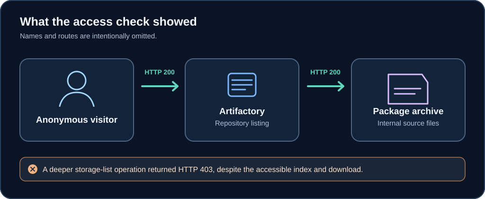

During testing on September 19, 2026, I found that a publicly reachable Artifactory instance allowed anonymous visitors to browse internal npm repositories and download package archives. The finding was about **internal source and build artifacts being exposed**, not a demonstrated credential leak.

*Illustration of the observed access paths. It is a reconstruction, not a screenshot of the target system.*

## What was exposed

Without signing in, I could retrieve a list of ten configured repositories: six local repositories and four virtual repositories. The local repositories included internal design-system packages, content API clients, web SDKs, partner-project code, command-line tooling, and media components. I identified **at least 83 package versions** across the six local repositories.

One package archive downloaded successfully with an HTTP 200 response and had the expected gzip format. Its contents included Node.js API-client implementation files. Those files revealed how an internal client was organized, including authentication-provider and content-management components. The exact host, repository names, package names, versions, and file paths are withheld here.

## How I checked it

1. From an unauthenticated session, I requested the repository list and received HTTP 200.
2. I opened a local repository index and could browse package namespaces and versions.
3. I downloaded a package archive directly, again receiving HTTP 200, and inspected its package metadata and source files.
4. I tried a deeper storage-list operation. That request returned HTTP 403 even though the HTML index and direct package download were accessible.

The mixed 200 and 403 responses matter: blocking one API operation did not protect the other read paths. The underlying issue was anonymous read authorization, not rate limiting or WAF behavior.

## Impact and limits

Internal npm packages can reveal application structure and API-client behavior beyond what a public directory listing shows. That information can help someone understand private implementation details and identify further areas to investigate.

I reviewed five downloaded packages for embedded secrets and found none. I therefore reported **source and artifact disclosure**, not credential compromise. The observations were verified from one European datacenter network on September 19, 2026; they do not establish that every network path behaved the same way or that access remains available today.

## What should change

Internal local repositories should require authentication for metadata, directory indexes, storage operations, and direct downloads. The same access policy should apply across every Artifactory read path. The exposed packages should be reviewed for non-public data, and access logs should be checked for historical anonymous browsing or downloads.

*Sensitive details have been removed so the behavior and its significance remain understandable without publishing the host or reusable internal identifiers.*
