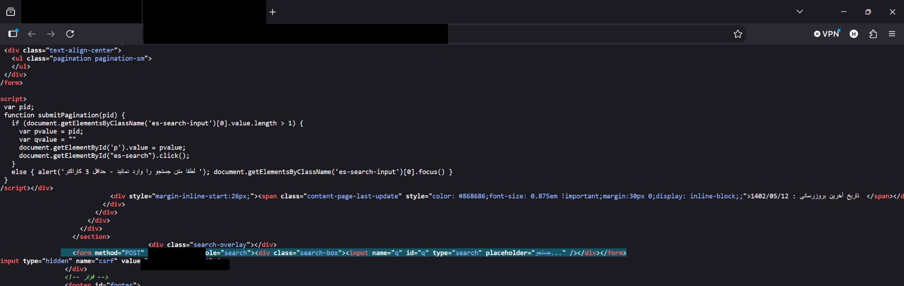
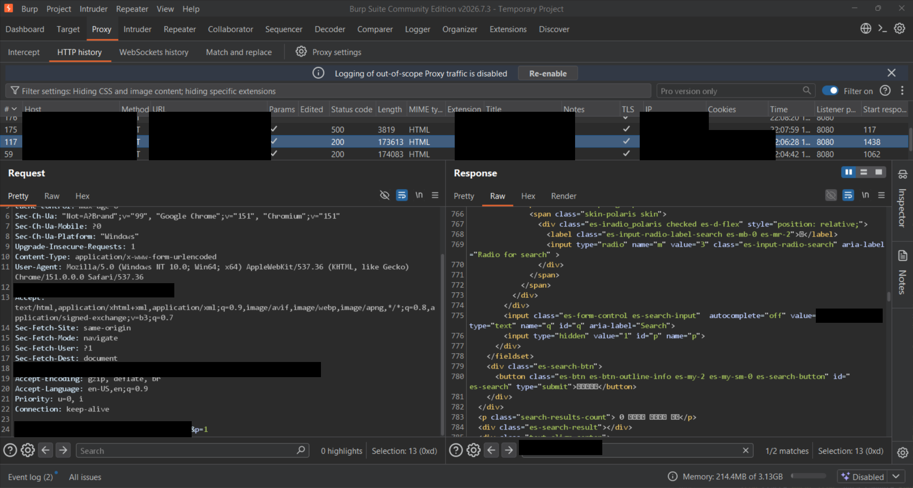
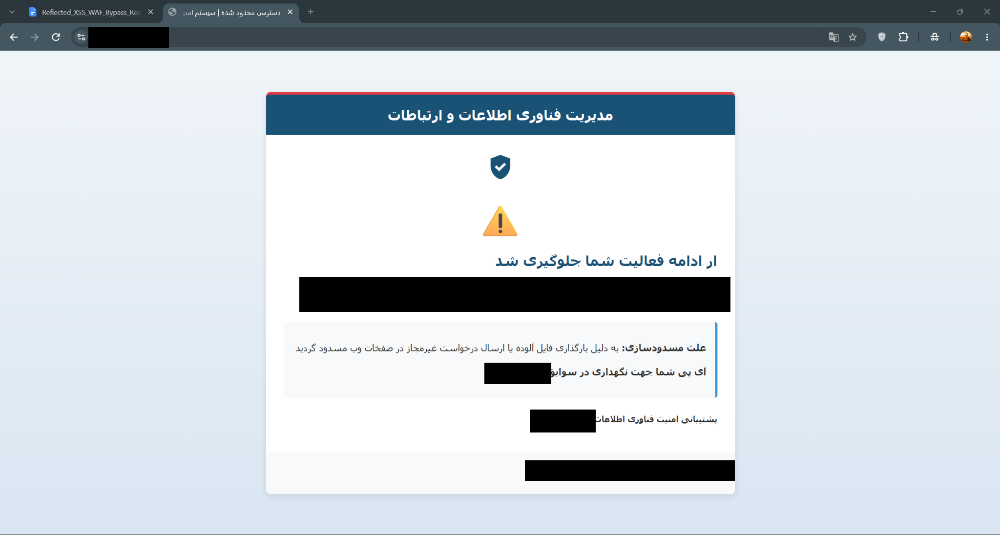
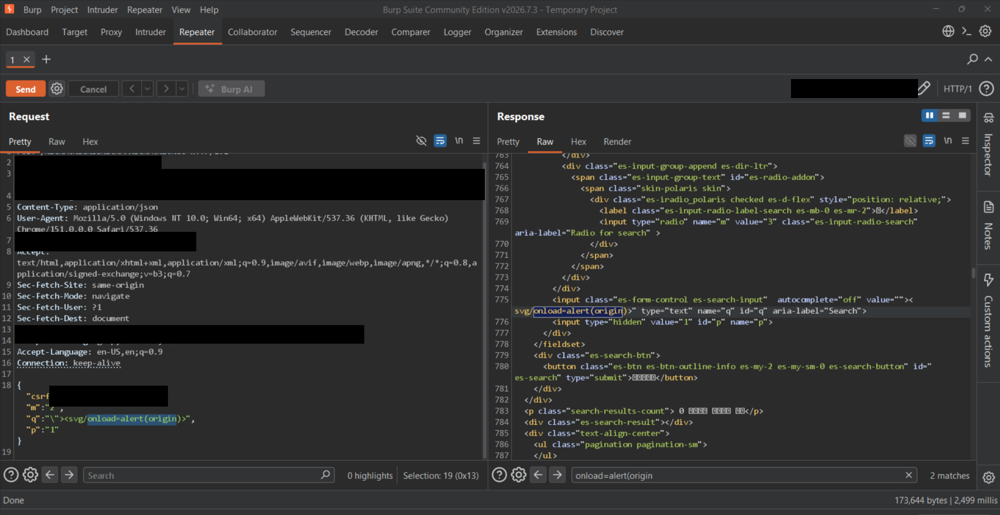
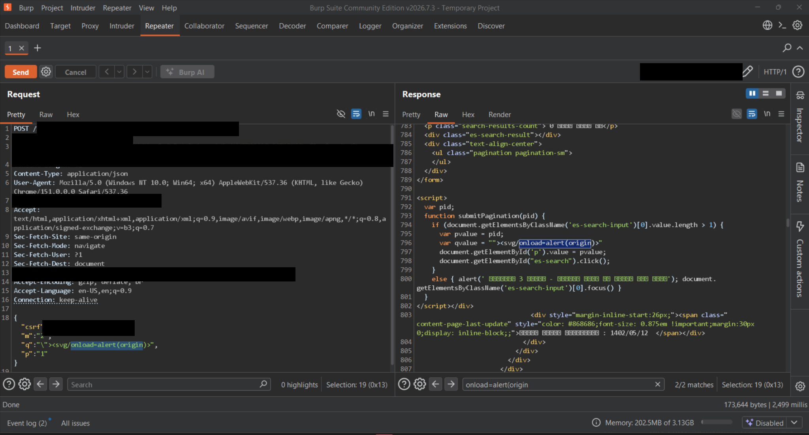
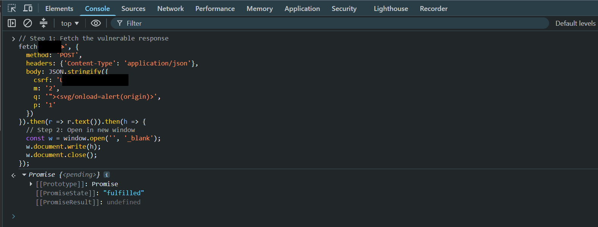
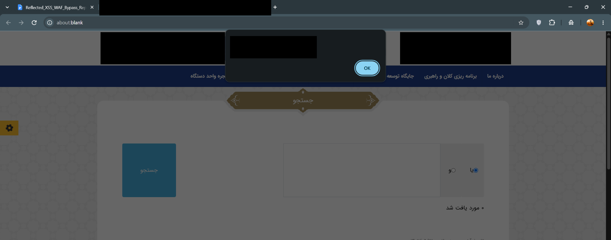

## The short version

On August 18, 2026, I tested a search page that put the `q` search term into two places in its response: an HTML input's `value` attribute and a quoted JavaScript string. Neither output context encoded the value safely. A harmless test payload, `"><svg/onload=alert(origin)>`, therefore became executable when the response was rendered as HTML.

The web application firewall (WAF) blocked the same kind of request in common form and text encodings with HTTP 403. Sending the body as `application/json` instead reached the application and returned HTTP 200 with the payload unencoded. In a **same-origin browser validation**, rendering that response triggered the alert. The original report assessed this as **Medium (CVSS 6.1)**. It did not establish a reliable way to deliver the JSON response to another user's browser, so this post does not claim a victim compromise.

The target's name, host, origin, identifying search path, IPs, cookies, and CSRF values are masked in this public version. The seven screenshots below are the **original report images**, with opaque black redactions over those details.

## How the search input became code

The first check used a unique, harmless search marker. The response echoed it into the search field. The page source also showed that the search form used `POST` and that `q` was the relevant input name.





The dangerous step was not reflection alone. It was reflection **without encoding for the destination**. The same `q` value appeared in an HTML attribute and in a JavaScript string. A quote and angle bracket could leave the intended value and introduce a new SVG element with an event handler. The JavaScript string needed safe serialization for its own context; HTML escaping alone would not be a complete fix for both sinks.

```html
<input ... value=""><svg/onload=alert(origin)>" ...>
```

```js
var qvalue = ""><svg/onload=alert(origin)>"
```

These are abbreviated response excerpts from the report, not a complete copy of the target page.

## Why the WAF did not stop the JSON request

The report compared request-body encodings while testing the same XSS pattern:

| Request content type | Observed HTTP result |
| --- | --- |
| `application/x-www-form-urlencoded` | 403, blocked by the WAF |
| `multipart/form-data` | 403, blocked by the WAF |
| `text/plain` | 403, blocked by the WAF |
| `application/json` | 200, processed by the application |

The original WAF screenshot shows a **blocked request**. Its old caption in the PDF described execution, but the image itself is evidence of the 403 side of this comparison.



The JSON request kept the same `q` payload. Burp then showed the HTML attribute breakout and the JavaScript-string reflection in the returned page.





## Reproduction and proof of concept

The host and `/search` path below are **illustrative replacements**, not the real target. The original search marker is replaced too. These steps describe the dated assessment rather than a claim that the endpoint remains vulnerable today.

```sh
# 1. Check for reflection with a harmless marker.
curl -sk 'https://target.example/search?q=TESTCANARY777' | grep TESTCANARY777

# 2. Send the non-destructive XSS proof as JSON.
curl -sk -X POST 'https://target.example/search' \
  -H 'Content-Type: application/json' \
  --data '{"q":"\"><svg/onload=alert(origin)>"}'
```

The second request returned HTTP 200 and an HTML response containing the unencoded value. To test what a browser would do with that response, I made a JSON request from a browser already in the target's origin and rendered its returned HTML in a new window. The source report's console proof included site-specific form fields; their token value and route are masked here.

```js
fetch('/search', {
  method: 'POST',
  headers: {'Content-Type': 'application/json'},
  body: JSON.stringify({
    csrf: '[redacted]',
    m: '2',
    q: '"><svg/onload=alert(origin)>',
    p: '1'
  })
}).then(r => r.text()).then(html => {
  const proofWindow = window.open('', '_blank');
  proofWindow.document.write(html);
  proofWindow.document.close();
});
```





The alert displayed the target origin in the original capture. That value is blacked out here; `origin` in the payload is the browser's JavaScript variable, not a published target address.

## Impact and limits

If an attacker can make a victim browser render this vulnerable response, script runs with that page's origin. Depending on the victim's session and browser protections, that can allow DOM access, same-origin requests, content spoofing, phishing overlays, or access to client-side data that is not protected by `HttpOnly`.

The evidence proves unencoded reflection, a JSON-specific WAF gap, and execution in a **same-origin validation flow**. It does **not** prove persistence, cross-origin delivery, account takeover, session-cookie theft, or a working link/form that would reliably deliver the JSON request to a victim. The report observed that ordinary GET or form-style delivery was blocked by the WAF and cross-origin JSON requests faced CORS preflight constraints. Those limits matter to the severity assessment.

## Recommended fix

1. **Encode for the HTML attribute.** Use the framework's context-aware escaping so `&`, `<`, `>`, quotes, and other special characters cannot break out of `value="..."`.
2. **Serialize values inserted into JavaScript.** Do not concatenate `q` into a quoted script string; use a safe JSON serializer or avoid the inline script sink altogether.
3. **Normalize WAF inspection across body types.** Apply equivalent parsing and rules to `application/json`, form, multipart, and text request bodies. The WAF is defense in depth, not the primary fix.
4. **Add a restrictive Content Security Policy.** A nonce-based policy that rejects inline event handlers reduces the impact of a future encoding mistake.
5. **Retest the exact JSON path.** Confirm the response contains encoded or serialized data and that rendering it does not execute the payload.

The application-level output-encoding failure is the root cause. Fixing only the WAF rule would leave the unsafe HTML and JavaScript sinks in place.
